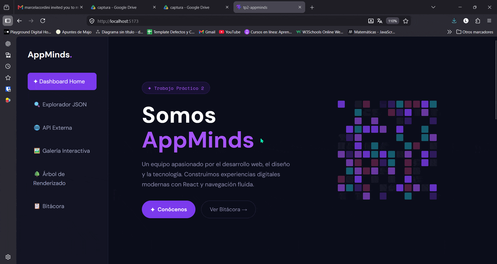
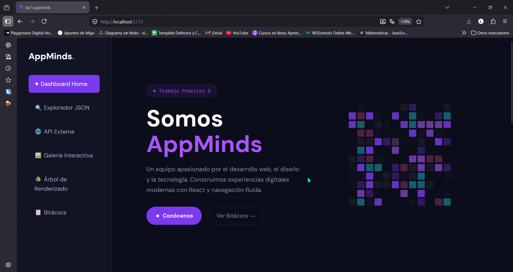
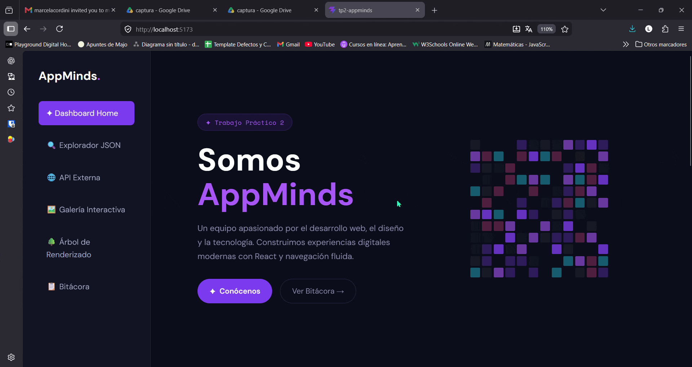
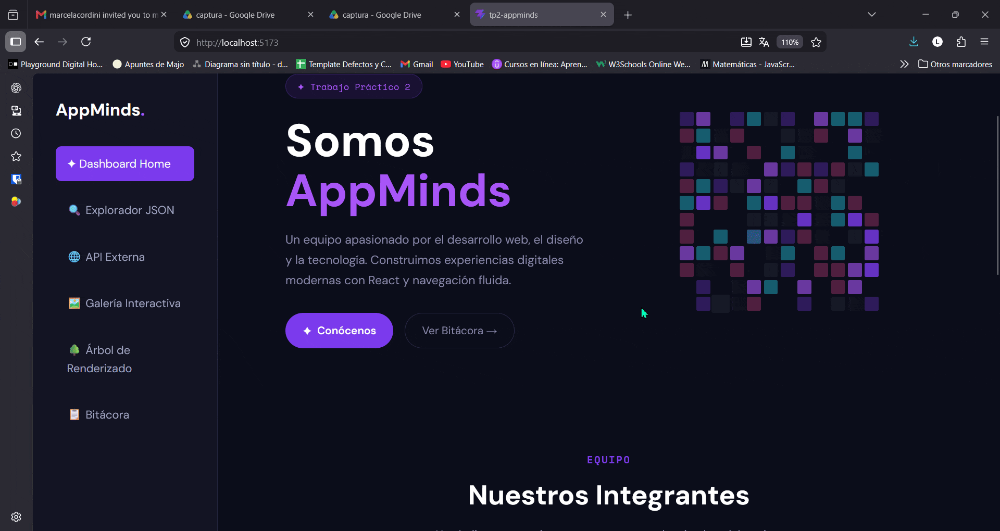
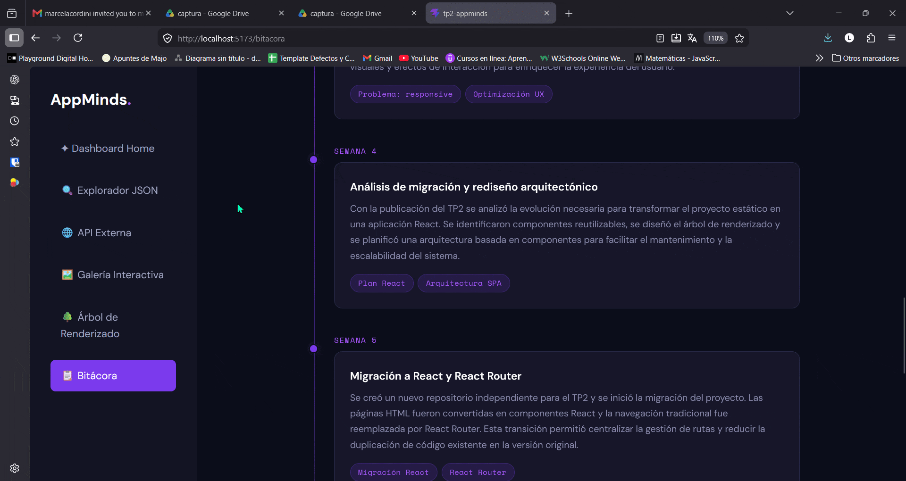
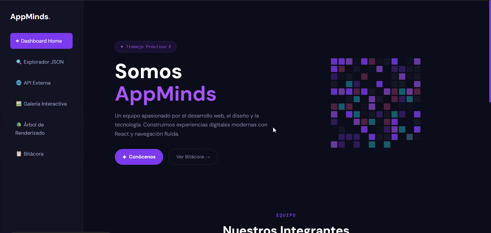
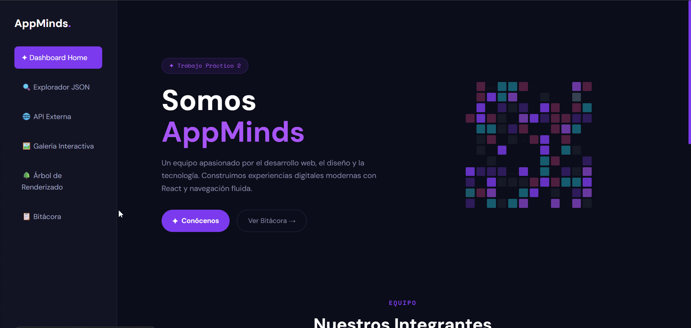

# 🎨 AppMinds - Dashboard Tech 
### Trabajo Práctico N°2 - Desarrollo Front End (React JS)

**Bienvenido al repositorio oficial del TP2 de AppMinds**. En esta entrega, migramos nuestra plataforma estática del TP1 hacia una Single Page Application (SPA) modular, robusta e interactiva utilizando **React** y **Vite**.

El sistema funciona como un Dashboard integral orientado al ecosistema tecnológico, implementando rutas dinámicas, consumo de APIs asincrónicas, manejo de estados globales/locales y efectos visuales avanzados.

**🔗 [Proyecto Desplegado en Vercel](https://fe-tp-2-grupal.vercel.app/)**

---

## 1. 📋 Descripción

**AppMinds** es una plataforma web educativa que integra un perfil profesional dinámico de cada integrante del equipo, un dashboard interactivo con múltiples secciones funcionales. La aplicación demuestra el dominio de conceptos avanzados de React como rutas dinámicas, consumo de APIs, gestión de estado y componentes reutilizables.

**Funcionalidades principales:**
- Navegación tipo Dashboard con Sidebar fija
- Perfiles profesionales dinámicos por integrante
- Explorador de datos con filtro en tiempo real
- Integración de API externa con paginación
- Galería interactiva con Lightbox
- Documentación de bitácora técnica
- Árbol de renderizado de componentes

---

## 2. 👥 Integrantes del Equipo

| Nombre | Apellido | GitHub |
|--------|----------|--------|
| Marcela | Cordini | [github.com/marcelacordini](https://github.com/marcelacordini) |
| Adriana | Coronel | [github.com/adco23](https://github.com/adco23) |
| Lucas | Monteras | [github.com/lucasmonteras](https://github.com/lucasmonteras) |
| Enrique | Saracco | [github.com/ewsaracco](https://github.com/ewsaracco) |

---

## 3. 🛠️ Tecnologías Utilizadas

| Categoría | Herramientas |
|-----------|-------------|
| **Frontend** | React JS 18+, React Router DOM v6 |
| **Build Tool** | Vite |
| **Estilos** | CSS3 Modular, Variables CSS, Animations |
| **APIs** | Rick and Morty API |
| **Fuentes** | Google Fonts |
| **Control de Versiones** | Git & GitHub |
| **Deployment** | Vercel |

---

## 4. 📁 Estructura de Archivos

```
FE_TP2_GRUPAL/
├── src/
│   ├── components/
│   │   ├── Layout
│   │   └── Sidebar
│   ├── pages/
│   │   ├── ApiModule
│   │   ├── Bitacora
│   │   ├── Explorer
│   │   ├── Gallery
│   │   ├── Home
│   │   ├── Profile
│   │   └── RenderTree
│   ├── hooks/
│   ├── data/
│   │   ├── herramientas.json
│   │   └── miembros.json
│   ├── assets/
│   │   └── css/
│   ├── App.jsx
│   └── main.jsx
├── public/
├── package.json
├── vite.config.js
├── index.html
└── README.md
```

---

## 5. 🎨 Guía de Estilos

### Paleta de Colores

```
Colores Primarios (Cyberpunk Dark):
  - Background principal: #0c0c18
  - Fondo secundario: #12122a
  - Cartas/panels: #161628
  - Borde/separadores: #2a2a4a
  - Acento principal: #7c3aed
  - Acento secundario: #a855f7
  - Acento adicional: #ec4899
  - Cyan brillante: #22d3ee

Colores Neutros:
  - Texto principal: #e2e2f0
  - Texto secundario: #8888aa
  - Blanco: #ffffff

Colores de Estado / gráficos:
  - Sombra morada: rgba(124, 58, 237, 0.3)
  - Glow morado: rgba(124, 58, 237, 0.25)
```

### Tipografías (Google Fonts)

- **Fuente principal / interfaz:** `DM Sans`
- **Fuente monoespaciada / código:** `Space Mono`

### Iconografía

- El proyecto no usa una librería de iconos externa específica instalada en `package.json`.
- Los iconos son representados con componentes nativos, texto e imágenes según cada sección.

---

## 6. 💻 JavaScript/React - Funciones Dinámicas e Implementaciones

### Componentes Clave Desarrollados

#### 1. **Sidebar Fija (Dashboard Navigation)**
```javascript
// Componente que persiste en todas las páginas
// Características:
// - Logo del grupo personalizado
// - Menú jerarquizado con React Router
// - Estilos responsive y transiciones suaves
```

#### 2. **Home & Panel Central (Grilla de Tarjetas)**
```javascript
// useParams para renderizado dinámico
// useState para manejo de estado local
// Animaciones de entrada: Fade-in y escalado
// Grid responsive que se adapta a diferentes resoluciones
```

#### 3. **Perfil Profesional Dinámico** (`/profile/:id`)
- **Barras de Progreso Animadas:** Componente reutilizable con `useState` y CSS animations
- **Carrusel de Proyectos:** Navegación con `useState` para índice actual
- **Social Media Buttons:** Efectos hover avanzados (cambio de color, escalado)
- **Tech Stack Dinámico:** Renderizado desde JSON con iconos animados

#### 4. **Explorador de Datos con Filtro Real-Time**
```javascript
const [filtroTexto, setFiltroTexto] = useState('');
const [filtroCategoria, setFiltroCategoria] = useState('todos');
const datosFiltrados = datos.filter(item => 
  item.nombre.toLowerCase().includes(filtroTexto.toLowerCase()) &&
  (filtroCategoria === 'todos' || item.categoria === filtroCategoria)
);
```
- Renderización de 20+ herramientas tecnológicas
- Búsqueda en tiempo real sin recargar página

#### 5. **API Externa - Rick and Morty**
```javascript
useEffect(() => {
  fetch(`https://rickandmortyapi.com/api/character?page=${pagina}`)
    .then(res => res.json())
    .then(data => setPersonajes(data.results))
    .catch(err => setError(err));
}, [pagina]);
```
- Paginación interactiva (Anterior/Siguiente)
- Indicador de página actual
- Spinner/Loader durante carga
- Manejo de errores

#### 6. **Galería Interactiva con Lightbox**
- Grid de imágenes responsive
- Modal flotante en pantalla completa
- Cierre con botón o tecla ESC (`useEffect` con event listener)
- Desenfoque de fondo (`backdrop-filter`)

#### 7. **Bitácora de Proyecto**
- Documentación técnica del proceso de migración HTML → React
- Roles y responsabilidades del equipo
- Flujo de trabajo (GitFlow, Trello)
- Desafíos superados y soluciones implementadas

#### 8. **Árbol de Renderizado (Componentes)**
```
App
├── Sidebar
└── Router
    ├── Home
    │   └── Grid de Tarjetas (useParams)
    ├── Profile/:id
    │   ├── Header
    │   ├── ProgressBars
    │   ├── Carousel
    │   ├── TechStack
    │   └── SocialButtons
    ├── Explorer
    │   ├── SearchBar
    │   ├── FilterButtons
    │   └── DataGrid
    ├── API
    │   ├── CharactersList
    │   ├── Pagination
    │   └── Spinner
    ├── Gallery
    │   ├── ImageGrid
    │   └── Lightbox Modal
    └── Bitacora
        └── DocumentationContent
```

---

## 7. 📱 Características y Módulos Desarrollados

El proyecto cumple al 100% con los requerimientos obligatorios de la cátedra:

### 1. **Home & Perfil Profesional Dinámico**
- Grilla simétrica de presentación del equipo
- Rutas dinámicas con `useParams` desde JSON centralizado
- Carrusel de proyectos con navegación manual
- Barras de progreso animadas
- Efectos hover avanzados en redes sociales

### 2. **Explorador de Datos Locales**
- Dataset con 20+ herramientas tecnológicas
- Filtro combinado (búsqueda por texto + categorías)
- Actualización reactiva en tiempo real sin recargas

### 3. **Módulo de API Externa**
- Consumo asincrónico de Rick and Morty API
- Paginación interactiva (Anterior/Siguiente)
- Spinner de carga animado
- Manejo de errores robusto

### 4. **Galería Interactiva**
- Grid de imágenes responsive
- Lightbox nativo con modal flotante
- Navegación interna y cierre con ESC
- Desenfoque de fondo (`backdrop-filter`)

### 5. **Bitácora de Proyecto**
- Documentación de roles y flujo de trabajo
- Justificación de migración HTML/JS → React
- Registro de desafíos y soluciones

### 6. **Árbol de Renderizado**
- Esquema gráfico de la estructura de componentes
- Relaciones jerárquicas claras
- Identificación de componentes reutilizables


---

## 8. 📸 Capturas de Pantalla

### 1. **Home & Perfil Profesional Dinámico**






### 2. **Explorador de Datos Locales**



### 3. **Módulo de API Externa**


### 4. **Galería Interactiva**


### 5. **Árbol de Renderizado**



### 6. **Bitácora de Proyecto**




---

## 9. 🚀 Instalación y Ejecución Local

Para correr este proyecto en tu computadora, sigue estos pasos:

1. **Clonar el repositorio:**
   ```bash
   git clone https://github.com/marcelacordini/FE_TP2_GRUPAL.git
   cd FE_TP2_GRUPAL
   ```

2. **Instalar dependencias:**
   ```bash
   npm install
   ```

3. **Ejecutar en modo desarrollo:**
   ```bash
   npm run dev
   ```

4. **Abrir en el navegador:**
   ```
   http://localhost:5173
   ```

5. **Compilar para producción:**
   ```bash
   npm run build
   ```

---

## 10. 🔗 Enlaces Importantes

| Enlace | URL |
|--------|-----|
| **Repositorio GitHub** | https://github.com/marcelacordini/FE_TP2_GRUPAL |
| **Proyecto en Vercel** | https://fe-tp-2-grupal.vercel.app |
| **TP1 Original** | https://github.com/adco23/FE_TP1_GRUPAL |

---

## 11. 🤖 Uso de Inteligencia Artificial

En este proyecto la inteligencia artificial se utilizó como herramienta de apoyo externo en el proceso de desarrollo. No hay ningún paquete de IA instalado en `package.json`; la IA funcionó como asistente para mejorar la calidad del contenido y resolver dudas técnicas.

### Alcance del uso de IA
- Asistencia en la redacción de documentación y del README.
- Sugerencias de estructura para la bitácora y presentación del equipo.
- Resolución de dudas de React, hooks y patrones de componentes.
- Revisión de lógica de estado, efectos y filtrados.
- Optimización de mensajes e ideas para la experiencia de usuario.

### Aplicación práctica
- **Contenido y documentación:** generación de descripciones de secciones, explicación de funcionalidades y organización de la guía de estilos.
- **Calidad del código:** revisión de `useEffect`, `useState`, manejo de promesas y refactorizaciones puntuales.
- **UX/UI:** recomendaciones sobre estructura de dashboard, tarjetas y navegación responsive.
- **Debugging:** ayuda para identificar errores de lógica en los módulos de filtrado y paginación.

### Verdadero rol de la IA
- La IA fue usada como **asistente técnico**, no como autor principal.
- El equipo realizó las decisiones finales de diseño, arquitectura y estilo.
- Todos los componentes y la estructura de la SPA fueron creados y adaptados por el grupo.

### Transparencia
- No se integró un servicio de IA dentro de la aplicación.
- No se cargaron modelos de IA en producción.
- La IA se empleó únicamente durante el desarrollo como apoyo informativo.

---

## 📝 Notas Adicionales

- La estructura modular permite fácil escalabilidad y mantenimiento
- Todos los componentes son reutilizables y parametrizables
- Se implementaron buenas prácticas de React (lifting state, composition)
- El código está comentado en secciones críticas
- Se sigue GitFlow para control de versiones

---
